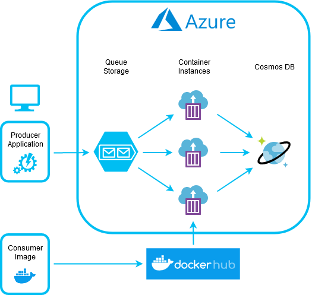
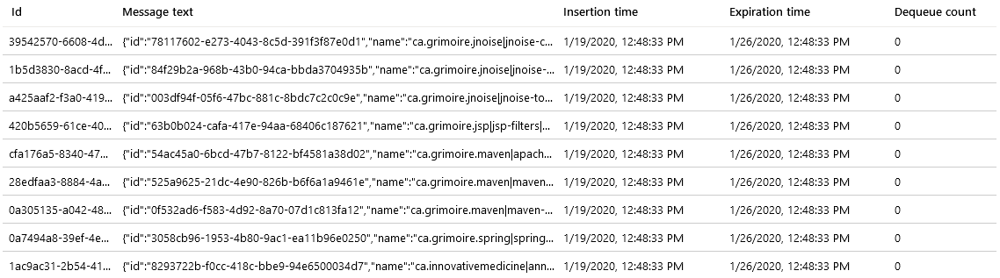
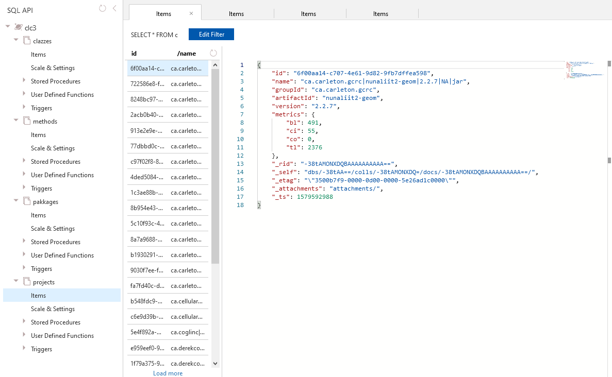
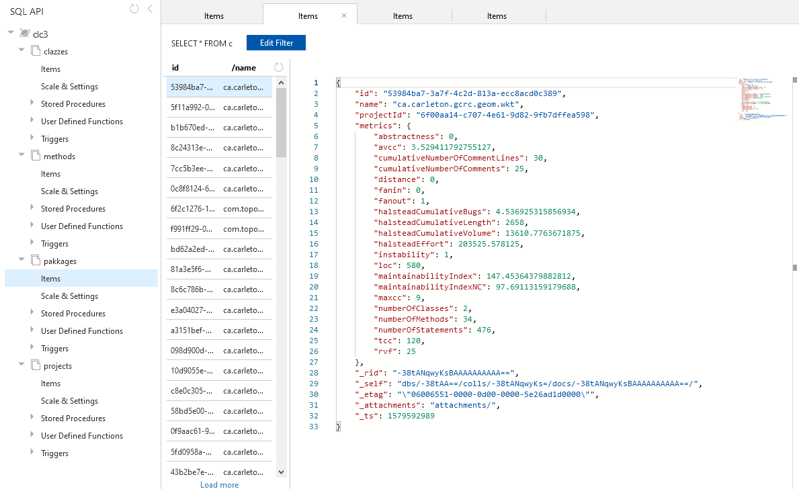
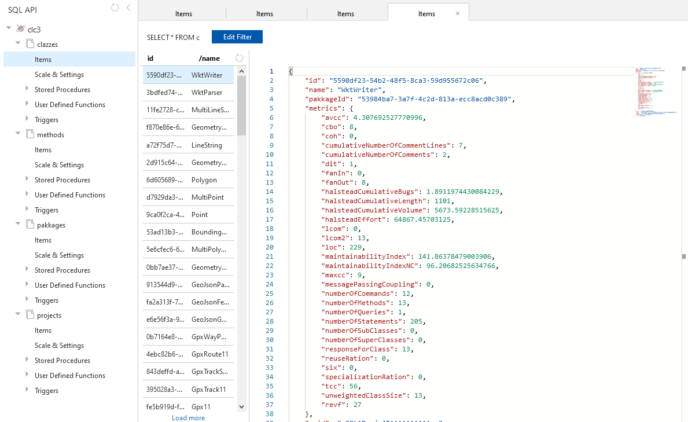
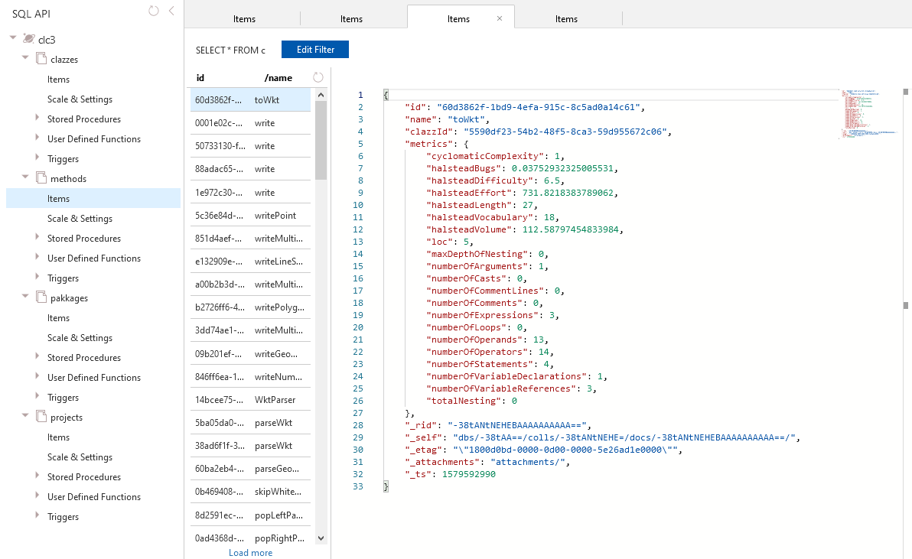

# Large-Scale Software Metrics Calculation in Azure

## Motivation

As part of my master's thesis, I have to calculate various software metrics
for a set of 240.000 software projects that I am retrieving from the Maven
Central Repository. Doing this locally on my personal PC is rather
time-consuming, taking around 3 days to 2 weeks as per current estimates. This
is certainly still within the realm of possibility, especially if everything
goes according to plan so that I only have to calculate the metrics once.
However, if I do have to re-calculate the metrics for yet unforeseen reasons,
a 2-week turnover time isn't ideal.

The main purpose of this project, therefore, is to evaluate whether cloud-based
execution of the metrics calculation could be a (financially) viable option for
achieving shorter turnover times. This would enable not just quicker processing
of the projects that I already have, thereby reducing the risk posed by the
need for potential metrics-recalculations, but might even allow me to extend
the scope of the thesis by either 1.) including more projects from other
sources in my analysis or 2.) analysing multiple versions of projects.

## Problem Statement

To get from projects in the Maven Central Repository to metrics that can be
analysed, the following processing steps have to be applied to each project:


**Download Project** retrieves the JAR file containing the project's source code
from the Maven Central Repository.

**Unpack Project** extracts the JAR file so it can be processed by the metrics
calculation tool.

**Calculate Metrics** executes [JHawk] - a tool for software metrics calculation
\- to calculate the metrics, thereby producing an XML file that contains the
metrics results.

**Persist Metrics** reads the calculated metrics from the metrics XML files and
saves them in a database.

All of these processing steps should be done in the cloud, utilizing some of
Azure's compute offerings for execution of the corresponding application and
storing the final metrics calculation results in a Cosmos DB instance.

## Architecture 

The image below shows an overview of the architecture that was implemented for
this project:



A producer application that runs "locally" fills a task queue (which uses Azure
Queue Storage) with retrieval information about the projects that should be
processed.

Tasks in the queue are processed by a number of Azure Container Instances,
which are built from a Docker image that contains the consumer application as
a fat JAR.

For each task/project, the consumer application executes the four processing
steps described in the "Problem Statement" section (download, unpack, calculate
metrics, persist metrics), so that the metrics calculation results for all
projects are available in the Cosmos DB instance once all tasks have been fully
processed.

## Implementation

### Producer Application

The producer application uses the [Maven-Indexer] library to retrieve a list
of projects that are contained in the Maven Central Repository. For each
project, it creates a task in the task queue using Akka's [Azure Storage Queue
Connector].

```java
@SpringBootApplication
public class ProducerApp implements CommandLineRunner {

    @Override
    public void run(String... args)  {
        ActorSystem system = ActorSystem.create();

        Source.from(Arrays.asList(this.indexer.getArtifactInfos()))
            .map(artifactInfo -> new Project(artifactInfo))
            .map(project -> new CloudQueueMessage(this.gson.toJson(project)))
            .runWith(AzureQueueSink.create(() -> this.queue), system);
    }

    ...
}
```

### Consumer Application

The consumer application retrieves the tasks in the task queue. For each task,
it executes the necessary processing steps and then removes the task from the
queue:

```java
@SpringBootApplication
public class ConsumerApp implements CommandLineRunner {

    @Override
    public void run(String... args)  {
        ActorSystem system = ActorSystem.create();

        AzureQueueSource.create(() -> this.queue)
            .map(message -> {
                Project project = this.gson.fromJson(message.getMessageContentAsString(), Project.class);

                this.downloadProject(project);
                this.unpackProject(project);
                this.calculateMetricsOfProject(project);
                this.persistMetricsOfProject(project);

                return message;
            })
            .runWith(AzureQueueDeleteSink.create(() -> this.queue), system);
    }
    
    ...
}
```

Writes to the Cosmos DB instance are performed using the DocumentDB API of the
[Cosmos DB Java SDK]:

```java
@Configuration
public class CosmosConfiguration {

    @Bean
    public ConnectionPolicy policy() {
        return ConnectionPolicy.getDefaultPolicy();
    }

    @Bean
    public CosmosClient cosmosClient(ConnectionPolicy policy) {
        return new CosmosClientBuilder(). ... .buildClient();
    }

    @Bean
    public CosmosDatabase cosmosDatabase(CosmosClient client) {
        return client.getDatabase("clc3");
    }
}
```

```java
@Repository
public class ProjectRepository {

    private CosmosContainer container;

    public ProjectRepository(CosmosDatabase database) {
        this.container = database.getContainer("projects");
    }

    public void createItem(Object item) {
        this.container.createItem(item);
    }

    ...
}
```

## Execution / Results

### Producer Application

Running the producer application fills the task queue with processing tasks:



### Consumer Application

Running the consumer application (or multiple instances thereof) empties the
queue again and fills the Cosmos DB database with metrics calculation results
for projects, packages, classes and methods:









## Course Questions

**Automated Infrastructure Provisioning?**

Both the Storage account and the Cosmos DB instance were created manually for
the project. This seemed good enough in these two cases, since both are supposed
to be long-lived.

The actual database and containers in the database are created automatically
by the consumer application on startup if they don't exist already.

Container instances that run the consumer application are created through the
Azure CLI with:

```
az container create --resource-group clc3-project --name clc3-container-$id-1810454004 --image wowmuch/clc3-consumer:1.0 --cpu 1 --memory 2 --restart-policy OnFailure --no-wait
```

As with the database and containers, the task queue is automatically created by
either the producer or consumer during their startup routine if it doesn't
exist yet.

**Scalability?**

The application scales basically without any limits, since processing of each
project is completely independent of processing of all other projects. To
improve throughput, one can just start more consumer instances and increase
the RU/s limits of the Cosmos DB accordingly.

Since costs and processing speeds scale linearly with the number of instances,
scaling doesn't even have any immediate downsides associated with it. However,
assuming I don't extend the scope of my master's thesis to more projects,
usefulness of reduced total processing time does start to decrease at a certain
point, because (ideally) I only have to do the processing once anyway.

**Fault Tolerance / Resilience?**

Since there are multiple consumers running, processing still continues even
if some consumers fail. Also, since the restart policy "OnFailure" is used,
consumer instances are automatically restarted if any of them fail.

If consumers fail, all tasks / projects will still be fully processed, even if
the failure occurred during processing of a task / project. This is because a
task is only actually deleted from the queue by a consumer once all processing
steps have been completed. If a consumer fails before this, i.e. before it
deletes a task from the queue, the dequeued tasks will become visible in the
queue again after 30 seconds.

If the Cosmos DB instance fails or is otherwise unavailable, the situation is
pretty similar. Consumers won't be able to insert data, which prevents them from
successfully completing all processing steps and, in turn, causes the unfinished
tasks to be become visible in the queue again.

**Replication?**

During development, replication wasn't enabled for the storage account or the
Cosmos DB instance for cost-saving reasons. However, if the project ever makes
it beyond the prototype stage, it would be trivial to add replication just by
changing the corresponding replication options in Azure.

**NoSQL?**

Data is stored in a Cosmos DB DocumentDB database. Admittedly, this is not
really ideal for the requirements of the project / master's thesis. A better
fit would be the Graph DB variant of Cosmos DB databases (the "cloud-less"
implementation that is currently used for the master's thesis uses Neo4j).
However, the Java implementation of the Cosmos DB Gremlin API didn't look all
that promising upon first inspection, which is why the decision was made to
go with the Document DB variant in this project.

**Costs?**

**Container instances** have the following costs associated with them:

Memory: $0,0000015 per GB-s  
vCPU: $0,0000135 per vCPU-s

Testing with 1000 projects has shown that containers reach a maximum memory
consumption of around 1.5GB (let's call that 2GB to have some safety buffer)
and that a 1vCPU containers needs on average about 6s to process a single
project.

Extrapolating from this, processing of 240.000 projects would require a total
processing time of 6s * 240.000 = 1.440.000s (~400 hours or ~16,5 days), with
the following total costs:

Total memory cost: $4,32 (= 1.440.000s * 2GB * 0,0000015$/s)  
Total vCPU cost: $19,44 (= 1.440.000s * 0,0000135$/s)

Overall container instance cost: **$23.76**

**Cosmos DB instances** have the following costs associated with them:

100 RU/s single-region account: $0,008/hour (= $0,0000000222/RU @ 100% utilization)  
1 GB of transactional storage: $0,25/month

Testing with 1000 projects has shown that write operations for a single project,
i.e. inserts for projects, packages, classes, methods and their corresponding
metrics, need about 635RU on average. Storage requirements are at around 0,5MB
per project.

Extrapolating to 240.000 projects, total costs for this would be the following
if 100% utilization could be achieved:

RU: $3,39 (240.000 * 635RU * $0,0000000222/RU @ 100% utilization)  
Storage: $30/month (240.000 * 0.5MB * $0,25/month)

However, due to the burst-y nature with which consumer instances are currently
writing data to the database (all project data is inserted basically at once
after metrics calculation for a project completes), actual average utilization
is much lower at around 10%. Because of this, a more realistic estimate for
RU costs would be 10 times as high. At least if the goal is not to run into
heavy rate limiting, which would increase required execution times (and
therefore costs) of the consumer instances.

RU: **$33,90** (240.000 * 635RU * 0,000000222$/RU @ 10% utilization)  
Storage: **$30/month** (240.000 * 0.5MB * $0,25/month)

Things could potentially be improved if metrics calculation (which produces XML
files) were to be decoupled from metrics persistence (which reads the XML files
and stores the data in the Cosmos DB database). Calculation instances could
then calculate metrics without any database-enforced rate limiting and put the
XML files into a storage account. Persistence units would take the metrics XML
files from the storage account and insert the metrics into the database at a
more predictable, i.e. less burst-y, rate, thereby enabling a higher average
utilization.

**Queue Storage** has to following costs associated with it:

Locally-redundant storage: $0.045/GB/month

Testing has shown that the total storage requirement for all 240.000 messages
is at around 66MiB. So even if these messages were all in storage at the same
time during actual processing, costs would still be at **less than $0,01 per
month**.

## Architecture / Implementation Discussion

**Why not run the producer application in Azure?**

Filling the task queue with tasks is not a bottleneck of the application, so
moving the producer application into the cloud wouldn't offer any worthwhile
benefits.

**Why not use Azure Functions or Batch?**

Processing times for projects are currently at around 6s per project when
executed on a 1 vCPU container instance, while start-up time for the application
is at around 3 seconds.

With a long-lived container instance that processes hundreds to thousands of
projects, this start-up overhead is negligible. However, with short-lived
functions or batch tasks that only process a single project each, the overhead
would be rather significant.

Of course, functions and batch tasks could also process more than one project
at a time, but turning functions / batch tasks into long-running instances that
process more than one request / task (i.e. a more complicated version of
container instances) seems to defeat their intended purpose for no good reason.

**Why not use Azure (Spot) VMs?**

Convenience and time restrictions.

I really did want to evaluate spot instances of compute optimized F1s VMs, which
would be around 50% cheaper than corresponding container instances or non-spot
VMs, but didn't manage to get the project running on them in time.

At least theoretically, spot VMs certainly do seems interesting. After all,
tasks in the project don't really need high availability or long continuous
uptimes, making them a pretty ideal candidate for execution in spot VMs and
the monetary benefits that this could bring.

However, use of spot VMs might also increase processing times if the requested
number of instances is not available continuously during processing.

**Why not use Azure Container Registry?**

Docker Hub provides an unlimited number of free public repositories and one
free private repository, which is good enough for the purposes of this project.

More advanced features of the Azure Container Registry are not needed.

[JHawk]: http://www.virtualmachinery.com/jhawkprod.htm

[Maven-Indexer]: https://maven.apache.org/maven-indexer/
[Azure Storage Queue Connector]: https://doc.akka.io/docs/alpakka/current/azure-storage-queue.html

[Cosmos DB Java SDK]: https://github.com/Azure/azure-documentdb-java
